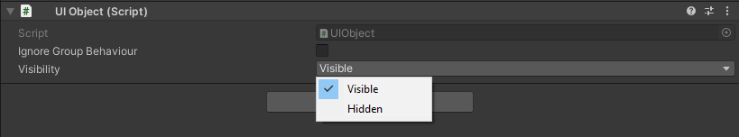
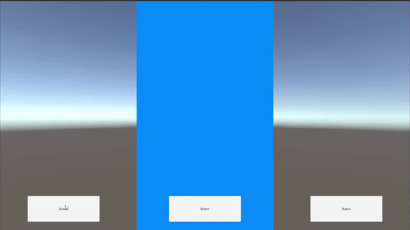
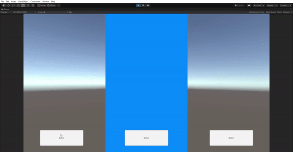
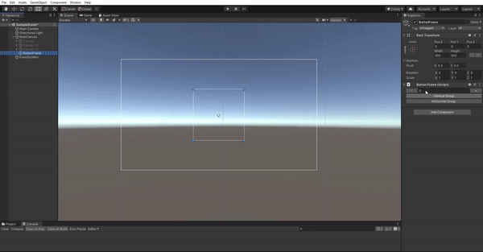

# UI Tools

UI tools is a collection of handy Unity tools that make creating and designing user interfaces in Unity a lot easier.

## Components

 - UIObject
 - Improved Canvas Group
 - Button frame

#### UIObject
Set canvas start visibility automatically, no need to manually activate or deactivate each view before starting testing.
Uses  `StateChanged` action to send information about canvas, which visibility has changed.

#### Improved Canvas Group

Group canvases together!
Automatically fetch all child canvases that have UIObject component.

Main feature are different visibility options on grouped canvases.
##### Single grouping
 - Only one canvas in group can be visible at one time.

##### Toggle grouping
- All canvases in the group can be activated or deactivated at the same time

#### Buttonframe

Automatically loads button prefab from resources folder and instantiates it.
Uses regular LayoutGroup component to adjust buttons.  

